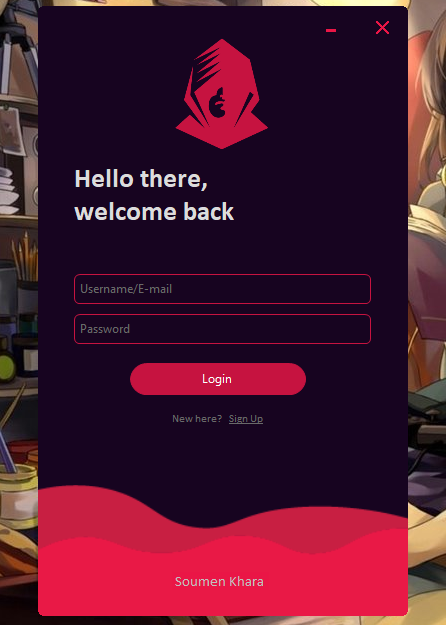
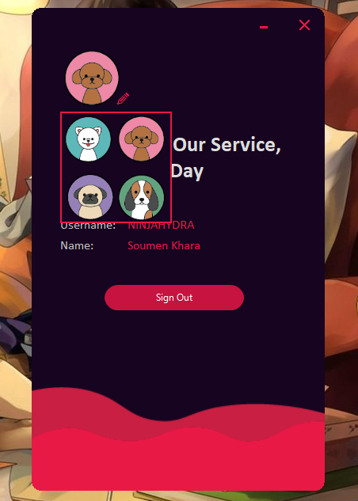

# VBdotNet Login System
It is a simple login system using dotNET abd MySQL




## Usage
First of all you have to use MySQL to database create or login user. You can use [XAMPP](https://www.apachefriends.org/index.html). If you use XAMPP the you have to create a dB name **vb**.**net**. Otherwise you have to change connection string locate in module file SQL.vb like this way,
```
con.ConnectionString = "server=[Server name];user=[user name];password=[password of that user]database=[dB name];"
```
After that download and install a UI frameworks [Guna Framework](https://gunaframework.com/). Then add to project reference.

